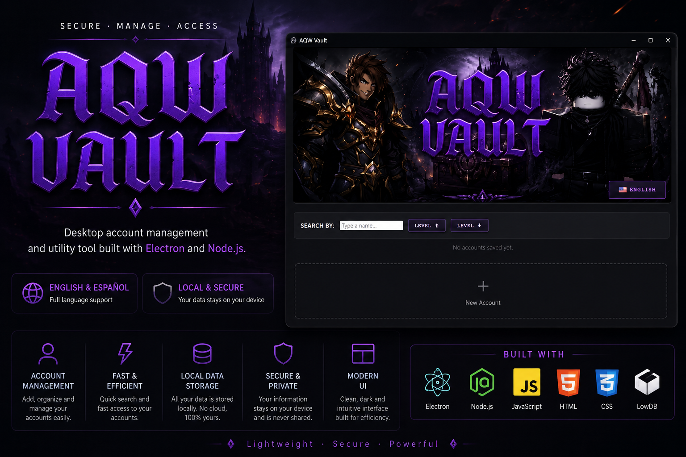
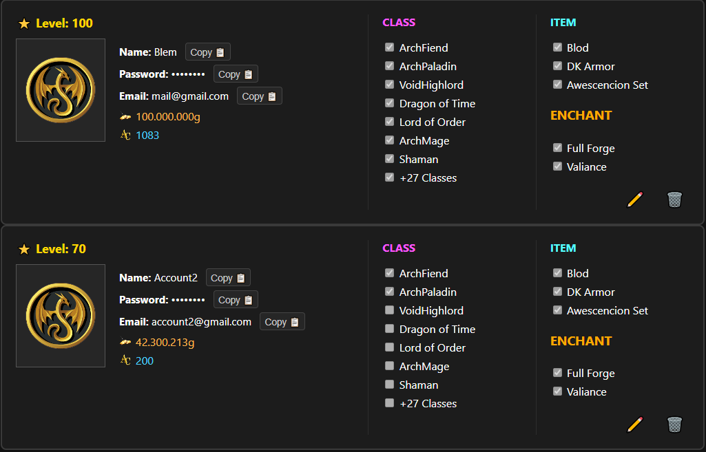
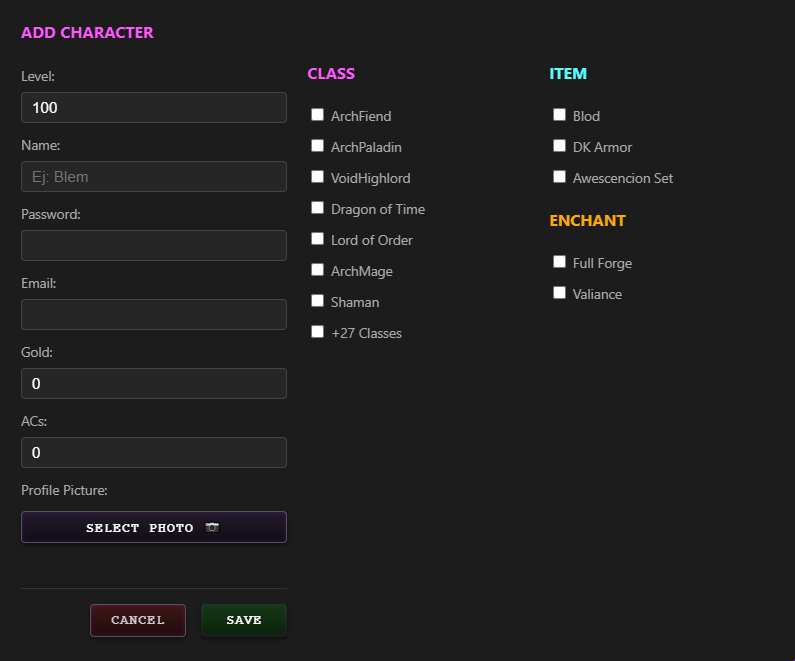

## AQW Vault


## Features

- Account management
- Modern desktop UI
- Local data storage
- Fast access system
- Languaje Español/English
- Portable

## Screenshot




## Installation

### Windows

Download the latest Windows release:

➡️ **[Download AQW Vault](https://github.com/Blem2011/aqw-vault/releases/tag/Windows(x64))**

Extract the ZIP file and run the executable.

---

### Build From Source

If you want to run the project manually:

#### Clone the repository

```bash
git clone https://github.com/Blem2011/aqw-vault.git
cd aqw-vault
```

#### Install dependencies

```bash
npm install
```

#### Start the application

```bash
npm start
```
